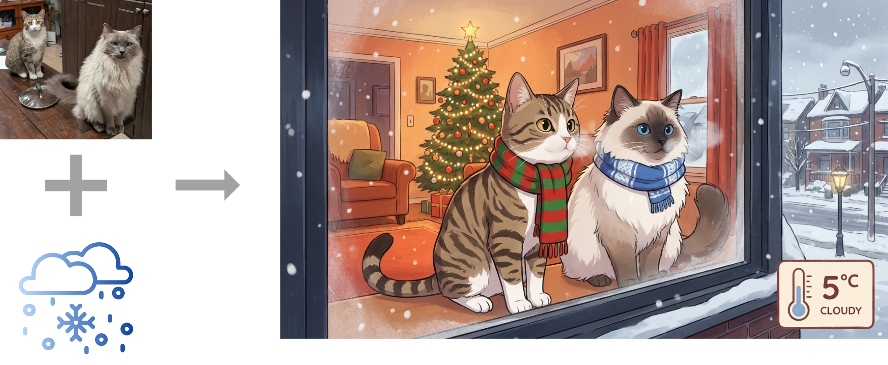
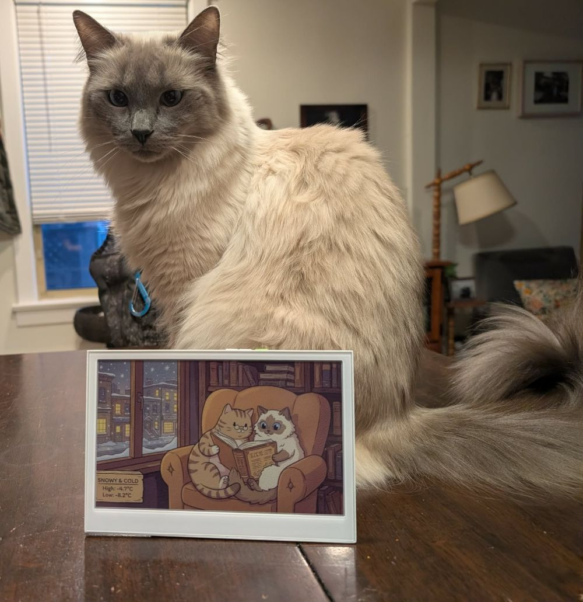
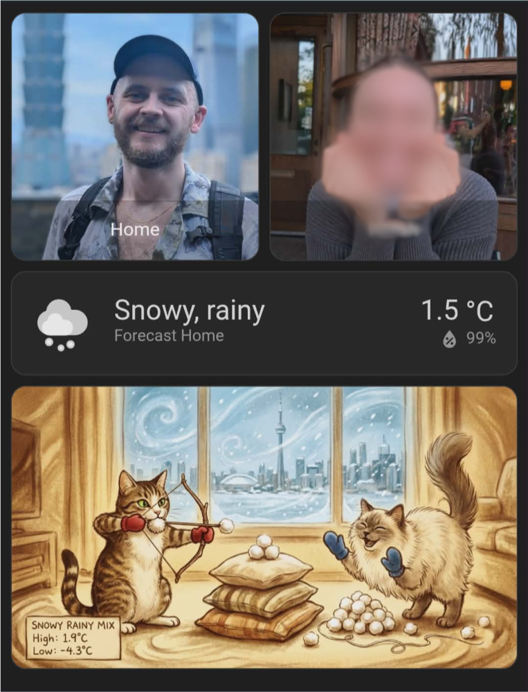

Forecats
=========
Wake up every morning (more) excited to look at the forecast! This is a custom Home Assistant integration which uses forecast data, pictures of your pets, and Google's Nano Banana API to generate and serve weather-themed drawings of your precious babies every morning. 

Blog post [here](https://secondthoughts.my/posts/projects/forecats/).



**Features**
- Home assistant integration to generate pictures
- Customizable automation template to control drawing styles, generation times, etc.
- Optional optimization for E-ink screens (currently limited to spectra6 panels)

## Examples

You can display it on an e-ink screen



Or on your HA Dashboard




Works in better weather


## Getting Started
> [!WARNING]
> This will cost money. You get (I think) $300 of Gemini credits upon sign up, but eventually you will have to pay ~$0.14 every time this runs.

### Requirements
- A [home assistant server](https://www.home-assistant.io/installation/) with the following add-ons
  - [File editor add-on](https://www.home-assistant.io/common-tasks/os/#installing-and-using-the-file-editor-add-on)
  - [Terminal and ssh add-on](https://www.home-assistant.io/common-tasks/os/#installing-and-using-the-ssh-add-on)
  - [Meteorologisk institutt (Met.no)](https://www.home-assistant.io/integrations/met/) integration
- Either:
  - A Google AI Studio [API key](https://aistudio.google.com/api-keys), or
  - An [OpenRouter API key](https://openrouter.ai/keys) plus OpenRouter text/image model IDs.

### Setup (HACS - recommended)
*Do the following in your HA server, using the Terminal & SSH addon, or `docker exec` if you are running a container on a host system*

1. **Create the necessary directory structure** in your Home Assistant server:

  ```bash
  mkdir /config/custom_components && mkdir -p /config/forecats_data/input_images
  ```

2. **Select and upload cat images**
  - Choose good pictures of your pets.
  - Rename the files so the pets' names are in the filenames.
  - Upload them to `/config/forecats_data/input_images`.

3. **Install via HACS custom repository**
  - Open HACS -> Integrations -> three-dot menu -> Custom repositories
  - Repository: `https://github.com/jwardbond/forecats`
  - Category: `Integration`
  - Install **Forecats** from HACS

4. **Add the integration via the UI**
  - Go to **Settings → Integrations → Add Integration → Forecats**
  - Select your AI provider (Gemini or OpenRouter)
  - Enter your API key (and model IDs if using OpenRouter)
  - You only need to do this once; credentials are stored securely in the integration

5. **Set up the automation** — choose one option:
   - **Blueprint (recommended):** Import [`config_examples/forecats_blueprint.yaml`](https://github.com/jwardbond/forecats/blob/main/config_examples/forecats_blueprint.yaml) via **Settings → Automations & Scenes → Blueprints → Import Blueprint**. Fill in the form inputs, then edit the `pets`, `input_image_paths`, and `art_styles` sections directly in the automation editor.
   - **Manual template:** Copy [`config_examples/automation_fragment.yaml`](https://github.com/jwardbond/forecats/blob/main/config_examples/automation_fragment.yaml) into `config/automations.yaml` and fill out all `<>` placeholders.

6. **Restart your server**

> [!Note]
> To update credentials later, go to **Settings → Integrations → Forecats → Configure**.

### Migrating from an older version (YAML config)

If you set up Forecats before v1.1.0, follow these steps:

1. **Remove** the `forecats:` line from `configuration.yaml`
2. **Add the integration via the UI** (see step 4 above) and enter your credentials
3. **Remove** `provider`, `gemini_api_key`, `openrouter_api_key`, `openrouter_text_model`, and `openrouter_image_model` from all automation `data:` blocks — these are now handled by the integration
4. **Restart** Home Assistant

### Manual install (fallback)
If you are not using HACS:

```bash
cd /config && git clone https://github.com/jwardbond/forecats.git
cp -r /config/forecats/custom_components/forecats /config/custom_components/
```

**That's it!** Every morning at 5:00 am, the forecats integration will generate the following images in the `config/www/daily_forecats/` directory:
- `forecats_original.png`: the unprocessed output image from Gemini
- `forecats_optimized.png`: the output image cropped to your desired size and adjusted for display on your screen (currently only supports color adjustments for Spectra6 e-ink)

These images should be accessible on your local network at (e.g.): `<YOUR HA URL>/local/daily_forecats/forecats_original.png`

>[!Note]
> It takes 10-30 seconds for gemini to generate the image. If you have any automations grabbing the image, then I recommend setting them to run a minute after the `generate forecats` autmation is set to run.

> [!Note]
> To test the automation, go to `developer tools > actions > generate forecats` and run it manually.


## Local Testing
I got annoyed testing out new prompts on HA, so I made a folder to experiment locally. If you would like to use it:

1. Clone the repo and enter the testing folder:
  ```bash
  git clone https://github.com/jwardbond/forecats.git && cd forecats/local_testing
  ```
1. Add your cat images to the `forecats_data/input_images` folder.
2. Create a `.env` file:
   - Gemini: set `GEN_PROVIDER=gemini` and `GEMINI_API_KEY`.
   - OpenRouter: set `GEN_PROVIDER=openrouter`, `OPENROUTER_API_KEY`, `OPENROUTER_TEXT_MODEL`, and `OPENROUTER_IMAGE_MODEL`.
3. Copy the data from your automation into `test.py`.
4. Run:
  ```bash
  uv run test.py
  ```

## (Optional) Sending to an e-ink screen
You will need a screen controllable with ESPHOME. I used seeed studio's [e10002 spectra6 display](https://www.seeedstudio.com/reTerminal-E1002-p-6533.html). I've included the esphome config I use [here](https://github.com/jwardbond/forecats/blob/ha_integration/config_examples/seeede1002.yaml). The basic idea is to set the automation to run every day at a 5:00 am, and have the screen wake up every day slightly before that, download the picture at 5:01 am (to leave time to generate), and then go into deep sleep until the next day.


## TODO
- [x] Enrol in HACS for easier install
- [x] Option to save images to dir
- [x] Make automation into blueprint for easier install
- [x] See if I can make it more configurable from GUI
- [ ] Support for multiple cities
